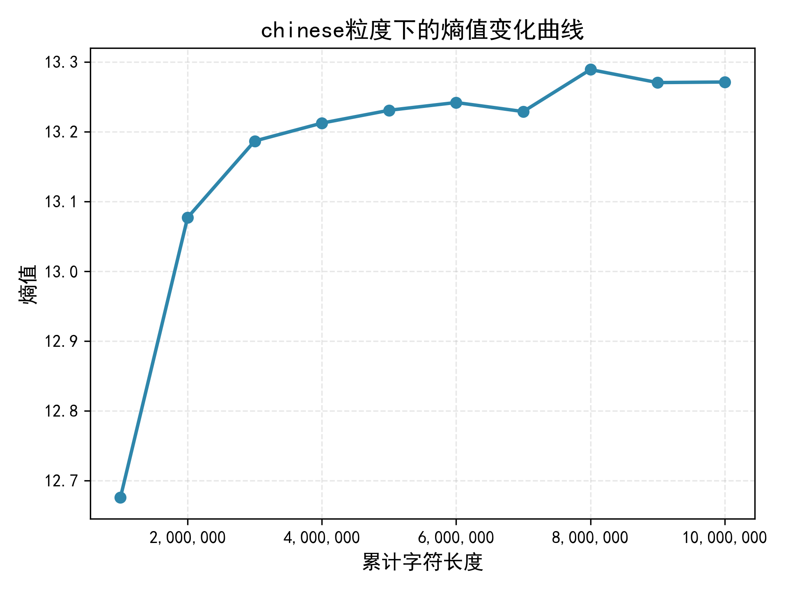
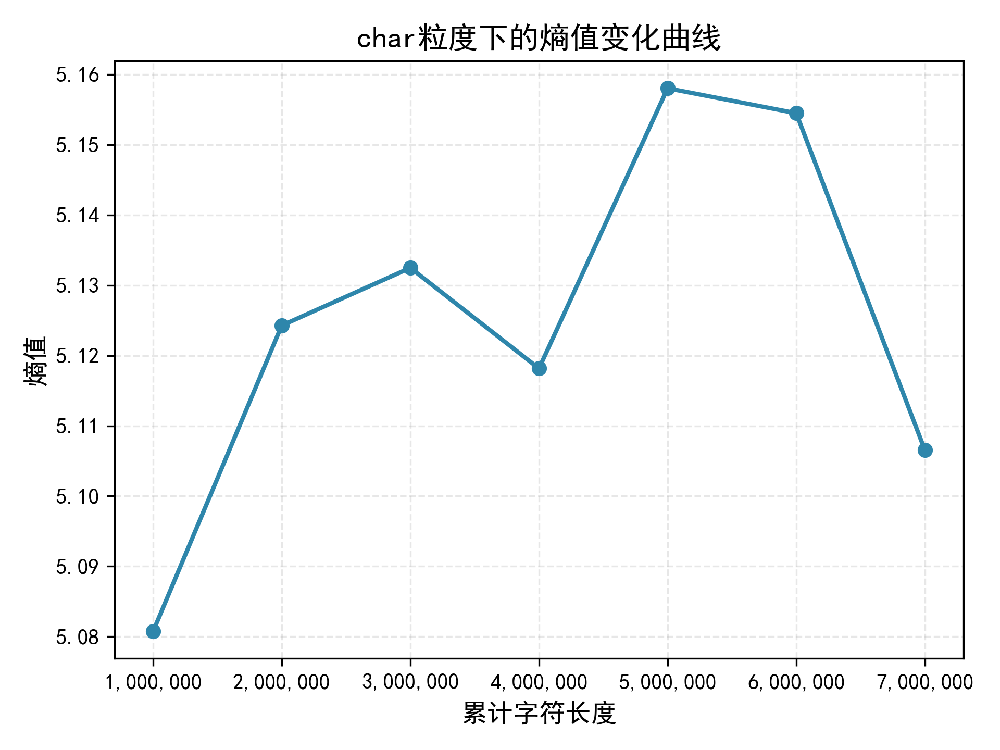
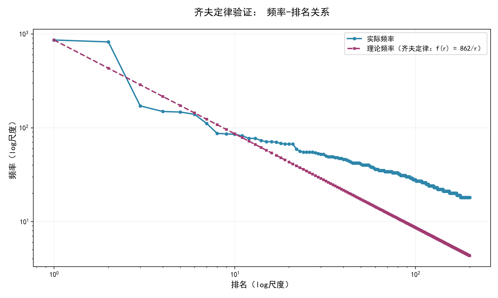

# 实验报告

> 姓名：蒋康
> 学号：202518014628074

选取题目为A题。

## 爬虫说明

本次实验使用了 Python 的 `requests` 库来进行网页请求，使用 `BeautifulSoup` 库来解析 HTML 内容。提取内容只包含具体新闻的正文内容部分，不考虑网页中的广告、导航栏等其他部分。爬取的代码见[crawl.py](crawl.py)。爬取的网站为[人民网](http://www.people.com.cn/)和[新华网](http://www.xinhuanet.com/)，每个网站爬取约`15000`篇文章。

## 数据处理

在爬取网页内容后，使用正则表达式处理内容, 其中采用了jieba分词工具对提取的文本进行分词处理，并使用nltk的停用词表去除停用词，统计时只统计长度超过5的单词。正则表达式内容见[utils/extract.py](utils/extract.py)。

## 熵和概率计算

熵值计算公式为：
$$ H(X) = -\sum_{i=1}^{n} P(x_i) \log_2 P(x_i) $$
其中，\( P(x_i) \) 是词 \( x_i \) 出现的概率。熵值计算代码见[compute_entropy.py](compute_entropy.py)。
绘出结果如下：

### 新华网结果

  

    
    
图1：新华网英文字母粒度熵变化曲线

  

  

    
    
图2：新华网英文单词粒度熵变化曲线

  

  

    
    
图3：新华网汉字粒度熵变化曲线

  

新华网数据按字符粒度熵约为`4.7`，按单词粒度熵约为`11.5`，按汉字粒度熵约为`13.2`。随着数据量的增加，熵值逐渐趋于稳定，说明在较大数据量下，文本的信息量趋于饱和。

### 人民网结果

  

    
    
图4：人民网英文字母粒度熵变化曲线

  

  

    
    
图5：人民网英文单词粒度熵变化曲线

  

  

    
    
图6：人民网汉字粒度熵变化曲线

  

人民网数据按字符粒度熵约为`5.1`，按汉字粒度熵约为`13.2`，按单词粒度文本的熵仍在不断增加，不能趋于稳定。可能的原因是：人民网的数据英文内容较为复杂，包含大量专有名词和技术术语，导致单词的多样性较高，从而使得熵值持续增加。

## 齐夫定律验证

齐夫定律为：在一个自然语言文本中，词语的频率与其排名成反比关系。即第 \( n \) 个最常见的词语的频率 \( f(n) \) 与其排名 \( n \) 满足关系：
$$ f(n) \propto \frac{1}{n} $$
为了验证齐夫定律，绘制了词频与排名的对数坐标图，并计算了实际频率与理论频率的对比。代码见[verify_law.py](verify_law.py)。绘出结果如下：

### 新华网结果

  

    
    
图7：新华网词频与排名对数坐标图 1M数据长度

  

  

    
    
图8 新华网词频与排名对数坐标图 10M数据长度

  

选取了1M和10M词汇量的结果进行对比，可以看到两者相差不大，但都离齐夫定律的理论曲线有一定距离。可能的原因是：在数据中，如`people`, `china`, `xinhua`这样的高频词出现频率相差不大，导致实际频率曲线在前端部分偏离理论曲线较多。

### 人民网结果

  

    
    
图9：人民网词频与排名对数坐标图 1M数据长度

  

  

    
    
图10：人民网词频与排名对数坐标图 7M数据长度

  

人民网的结果显示，在1M数据量下，实际频率曲线与理论曲线有明显偏差，而在7M数据量下，实际频率曲线更接近理论曲线，在词频较低的部分出现明显偏离。这表明随着数据量的增加，词频分布更符合齐夫定律的预期。
