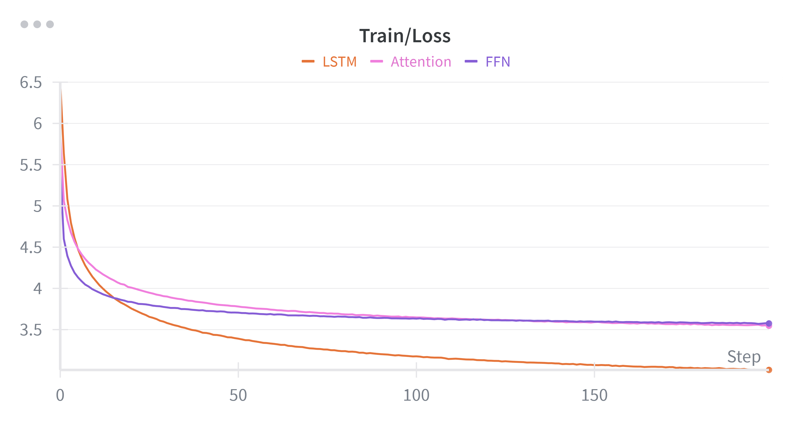

# 实验报告
> 蒋康
> 202518014628074

## 实验目的
本次实验是为了对比以下三种语言模型的困惑度：
1. 前馈神经⽹络
2. 循环神经⽹络
3. 自注意力机制

## 数据集及处理
[https://data.statmt.org/news-crawl/zh/](https://data.statmt.org/news-crawl/zh/)
- 文件内容为每一行一个句子，从上下文中可以知道，每一行句子之间是不相关的。
- 对每个文件抽取最后1000个句子作为测试集，前面的句子作为训练集。
- 每句话作为一个样本，使用`bert-base-chinese tokenizer`进行分词，将文本转化为`token ids`。取句子的前n-1个token为输入，第1到n个token作为标签训练模型。
- `bert-base-chinese tokenizer`的词表大小为21128。
- 对数据集进行统计，句子的平均长度约为50个token，最长的句子约10000个token，取max length为200，超过200的句子截断，少于200的句子补齐，对应补齐的位置标签设置为-100，不参与loss的计算。
- 统计得到训练的样本数为`27659416`，样本量巨大，如果全部进行训练，训练一个epoch的时间在RTX 5090上约需要8小时，因此对train set做随机采样，每一次采样batch_size * 1000个样本。

## 困惑度
困惑度（Perplexity，PPL）是衡量语言模型好坏的一个重要指标。它表示模型对测试集的预测能力，数值越低表示模型性能越好。困惑度的计算公式如下：
$$PPL = exp\left(-\frac{1}{N} \sum_{i=1}^{N} \log P(w_i|w_{1:i-1})\right)$$
- 其中，N是测试集中词语的总数，$$P(w_i|w_{1:i-1})$$是模型预测第i个词语的概率。
可以看到，困惑度的指数部分是交叉熵损失。

## 模型

为了方便对比，我们让三种模型都输出对第1到n个token的预测。

### 前馈神经网络

- 采用n-gram模型，让模型的第一个linear层的输入是对n个token的平均，考虑到对不同token的位置的加权权重和为了便于输出为序列，此处采用卷积层进行实现，经过卷积后的输入，每一个token的信息不包含未来token的信息，可以正确计算困惑度。我训练时取n=5。

### 循环神经网络

- 采用LSTM模型，输入为前n-1个token的embedding，输出为第1到n个token的预测。考虑LSTM每一步的输出不会包含未来token的信息，因此可以正确计算困惑度。

### 自注意力机制

- 需要添加mask以正确计算困惑度。
- 其中包含有pad mask 和 causal mask， pad mask用于屏蔽补齐的token，causal mask用于屏蔽未来的token。

## 训练

### 超参数

- batch size: 128
- learning rate: 1e-4
- epoch: 200
- 优化器: Adam
- 设备: RTX 5090

### loss曲线

训练过程的loss曲线：

测试集的loss曲线：

## 结果

三种模型在测试集上的困惑度如下：
| 模型               | 困惑度 (PPL) |
|------------------|--------------|
| FFN        | 40.3935        |
| LSTM        | 22.9229        |
| Attention        | 37.8443        |

## 分析

- 从结果可以看出，LSTM模型的困惑度最低，表现最好。这可能是因为LSTM能够更好地捕捉序列中的长期依赖关系，从而提高语言模型的预测能力。
- 前馈神经网络的困惑度最高，表现最差。在n-gram模型中，前馈神经网络只能利用有限的上下文信息，无法捕捉更长距离的依赖关系，导致其预测能力较弱。
- 自注意力机制的困惑度介于两者之间，但是效果不佳。可能的原因是训练数据量过大，训练时间不足，导致模型未能充分学习数据中的模式。

由此可以看出，选择合适的模型结构对于提升语言模型的性能至关重要。在实际应用中，应根据具体任务和数据特点选择合适的模型架构。