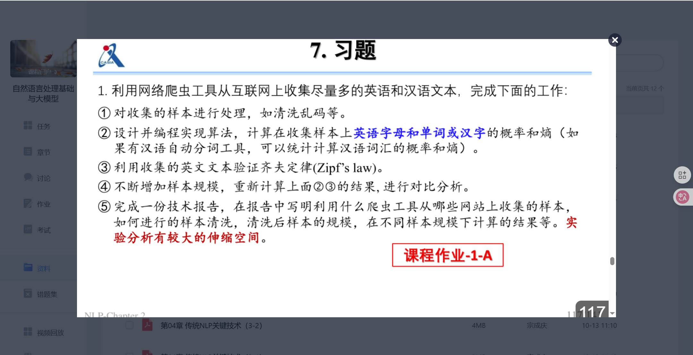

# 实验报告

> 姓名: 蒋康
> 学号：202518014628074

选取题目为A题。


## 爬虫工具

本次实验使用了 Python 的 `requests` 库来进行网页请求，使用 `BeautifulSoup` 库来解析 HTML 内容，并使用 `html2text` 库将 HTML 转换为 Markdown 格式, 便于去除html相关标签。爬取的网页内容被保存为 Markdown 文件，方便后续的文本处理和分析。

## 数据处理

在爬取网页内容后，使用正则表达式提取中文字符，去除非中文内容。正则表达式如下：

```python
import re
def extract_chinese(text):
    return ''.join(re.findall(r'[\u4e00-\u9fff]', text))
```

## 分词工具

采用了jieba分词工具对提取的中文文本进行分词处理，并使用nltk的中文停用词表去除停用词。

## 齐夫定律验证

使用Python的`collections.Counter`类统计词频，并对词频进行排序。然后计算词频与词频排名的关系，绘制齐夫定律图像。
